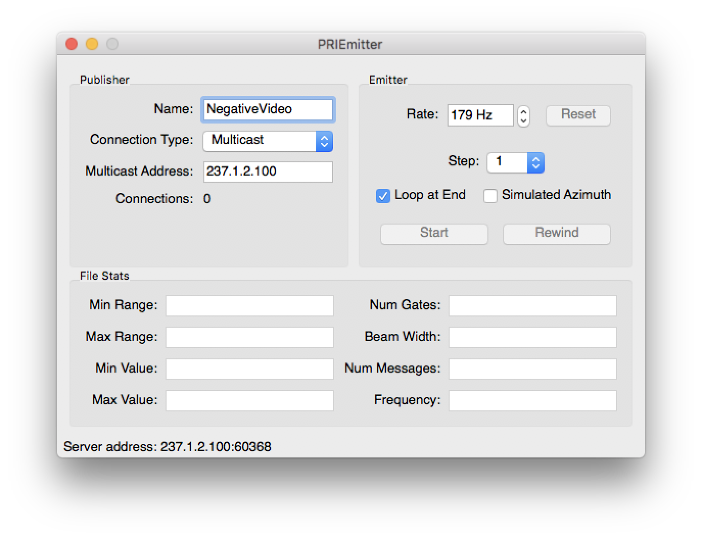
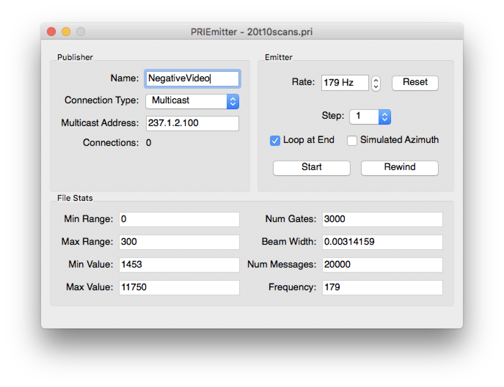
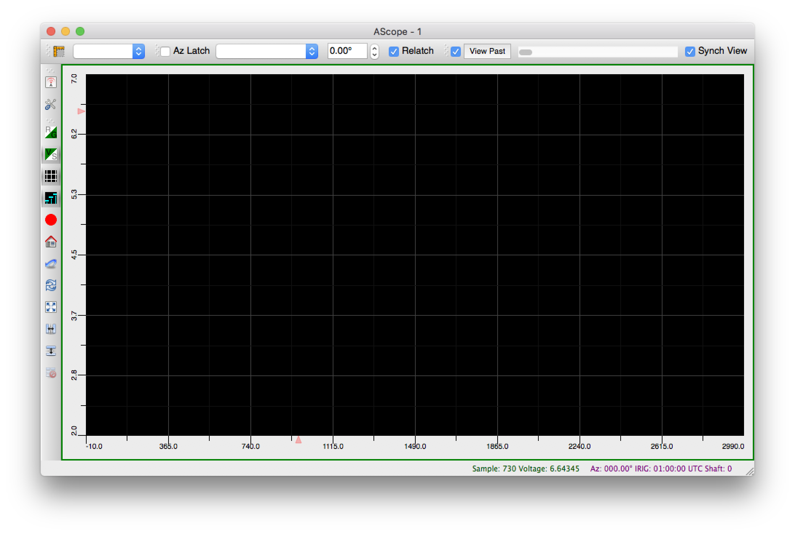
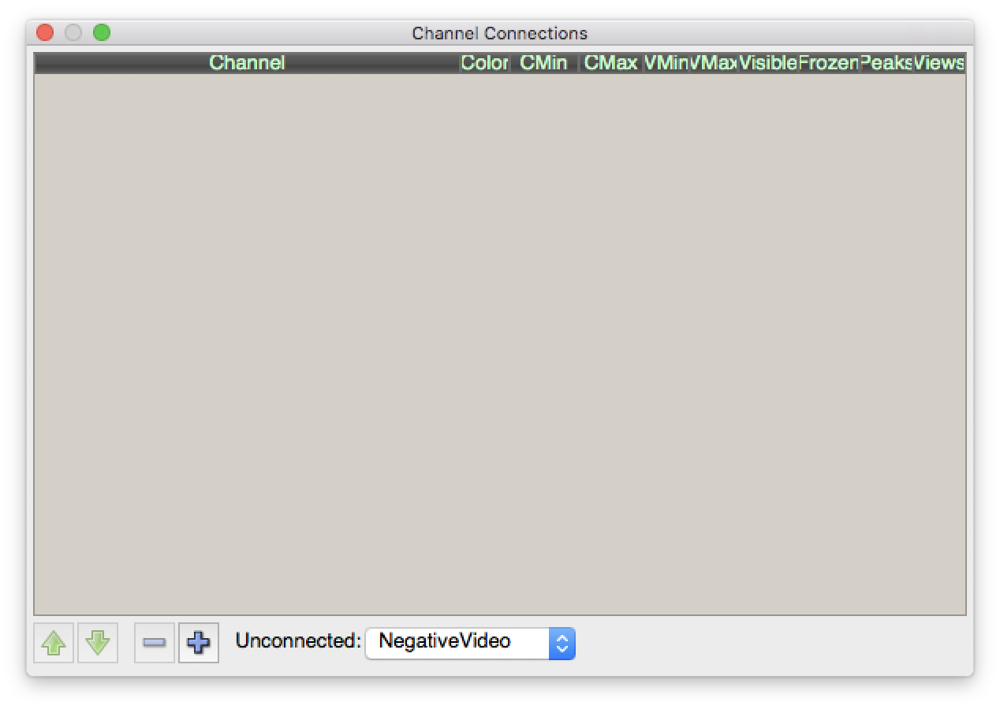
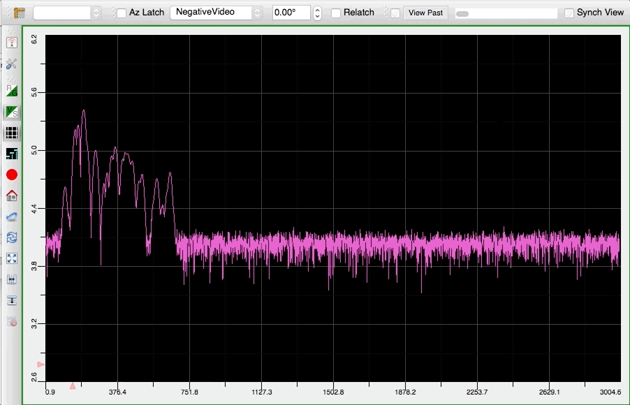
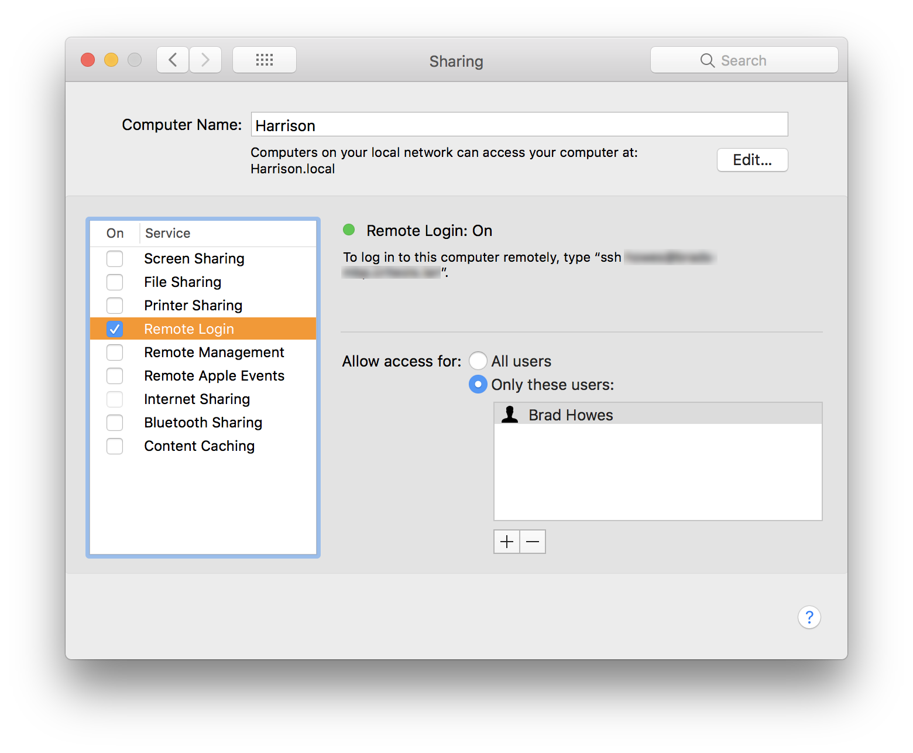
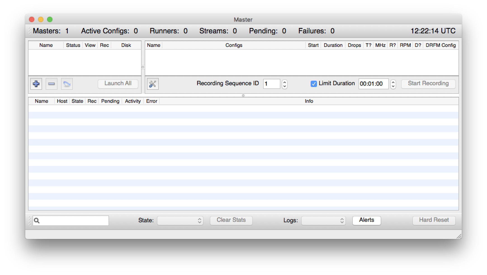
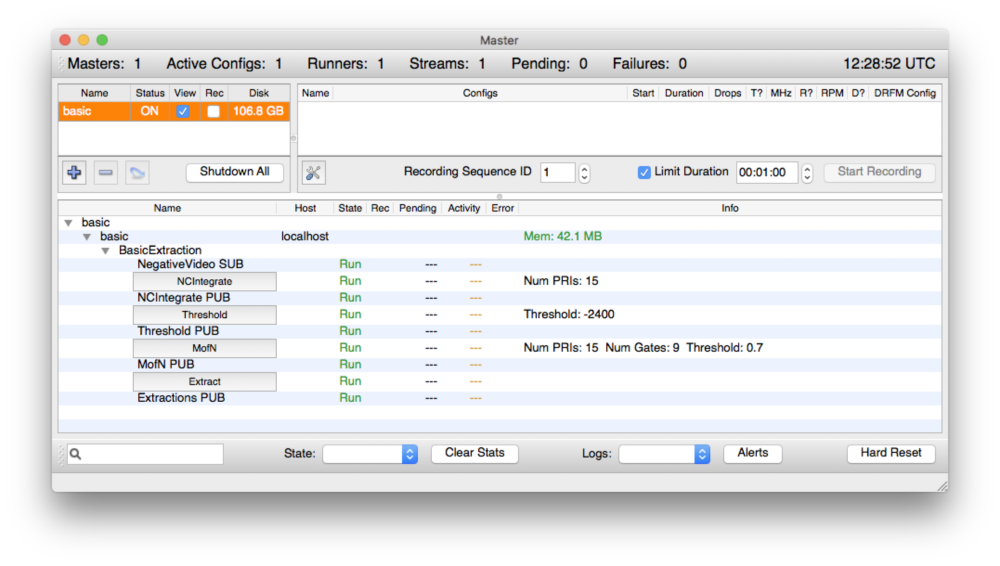
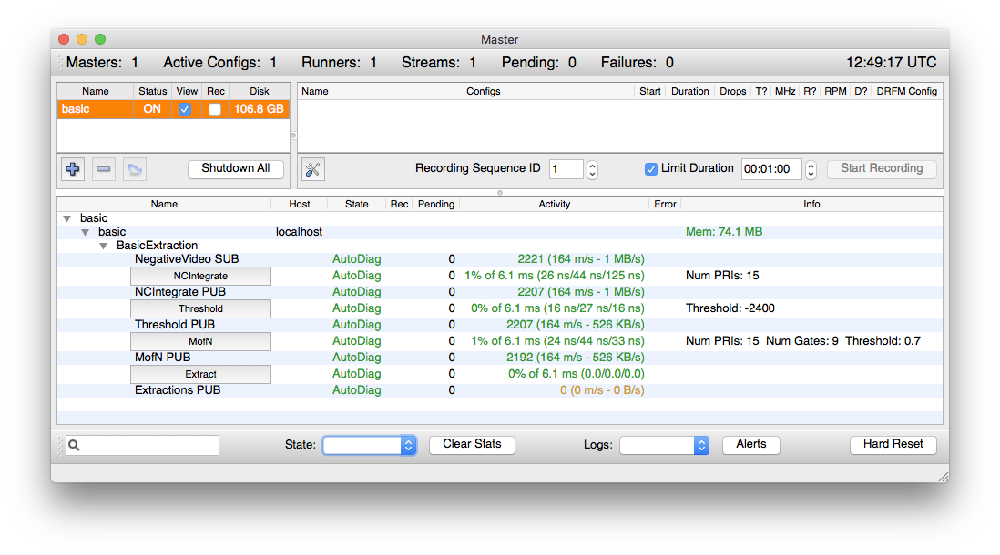

# Introduction

The main goal of the Radar SideCar software project is to create a highly adaptable environment for running
signal processing algorithms. Users configure signal processing streams using XML configuration files that
define how information flows from algorithm to algorithm and how data flows from machine to machine in the
SideCar LAN.

There are several applications available which provide a graphical interface to the user:

* AScope - a software oscilloscope for viewing data samples ([additional info](http://keystrokecountdown.com/articles/ascope/index.html))
* BScope - a rectangular representation of radar returns - contrast with PPIDisplay's polar display ([additional info](http://keystrokecountdown.com/articles/bscope/index.html))
* Master - a process manager application that shows the active processing streams running in the SideCar LAN
* Playback - an application that can playback recorded data files. Supports playback rate changing and looping when it reaches the end of a data file
* PPIDisplay - a simulation of a phosphor plot position indicator (PPI) display. Even has a crude simulated decay effect for those that can't live without phosphor decay ([additional info](http://keystrokecountdown.com/articles/radardisplay/index.html))

Various signal processing algorithms can be found in the Algorithms directory.

# Documentation

Many but not all of the source headers have JavaDoc-style comments. Using `doxygen`, one can convert them into
a static web site:

```
% cd ~/src/sidecar
% doxygen doc/Doxyfile
```

The HTML output will reside under the `docs/`. It is available online at
https://bradhowes.github.io/sidecar/index.html

# Building

Building has worked on various Linux and MacOS X systems. Nearly all of the code is C++ with some bits in C. The
code relies on the following external libraries:

* [ACE](http://www.cs.wustl.edu/~schmidt/ACE.html) - should work with at least version 5.5
* [Boost C++ Framework](http://boost.org) - built and tested using v1.60.0
* [Qt](http://qt.io) - built and tested using v4.8.7. **See Qt5 branch for a v5 version**
* [Zeroconf](http://www.zeroconf.org) - on Linux, requires Avahi's mDNS API emulation support (legacy)
* [OpenVSIP](https://github.com/openvsip/openvsip) - vector signal and image processing library

[CMake](https://cmake.org) scripts control the building process, and require at least v3.6. The usual way to
build is to create a build directory, move into it and then execute `cmake ..` to generate Makefiles, like so:

```
% cd ~/src/sidecar
% mkdir build
% cd build
% cmake ..
```

If successful, one should then just type `make` to build the executables.

## MacOS Installation Notes

Here are some brief notes on getting everything to run on macOS. This works on my MacBook Pro 2017 running High
Sierra (10.13.3). Install the [Brew](https://brew.sh) package manager if you don't already have it. Next,
install the following packages (I've noted the versions that I currently have)

```
% brew install cmake # 3.10.3
% brew install ace # 6.4.7
% brew install boost # 1.66.0
% brew install fftw # 3.3.7
% brew install open-mpi # 3.0.0
```

Unfortunately, SideCar also needs a legacy (v4) version of [Qt](https://qt.io). There is a Brew formula
available for this at https://github.com/cartr/homebrew-qt4 -- see the instructions there for installing.

> The `Qt5` branch now builds with Qt 5.10.1. You need to install Qt and find the directory where
> `Qt5Config.cmake` resides. This location must then be given to `CMake`. See below.

The software also needs an implementation of the
[Vector Signal and Image Processing Library](http://openvsip.org) spec. I have a slightly modified fork of
[OpenVSIP](https://github.com/openvsip/openvsip) that compiles on macOS. To install:

```
% git clone https://github.com/bradhowes/openvsip.git
% cd openvsip
% ./autogen.sh
% mkdir objdir
% cd objdir
% ../configure --with-lapack=apple # only if on macOS
```

If all goes well with `configure`, you should be able to build:

```
% make
% make install
```

If `configure` has issues, you will have to explore its options to see if you can get it to do what you want.

Now to build SideCar:

```
% git clone https://github.com/bradhowes/sidecar.git
% cd sidecar
% mkdir build
% cd build
% cmake ..
```

**NOTE**: If using Qt5 branch, the last command should be:

```
% cmake -DQt5_DIR=/Users/howes/Qt/5.10.1/clang_64/lib/cmake/Qt5 ..
```

where the given path pertains to the Qt5 installation on your machine. In the given path, `CMake` must be able
to find the `Qt5Config.cmake` file.

Hopefully `CMake` will find everything and run without errors. Next:

```
% make
```

This will take some time -- you can try adding `-j N` where N is something like the number of CPUs on your
machine.

## Environment Configuration

Various parts of the software like to know where it was installed, and they expect to find an environment
variable called `SIDECAR` that holds the installation directory. For our purposes, we will just set it to the
`build` directory that holds the output of the `make` operation.

```text
% export SIDECAR="$PWD"
```

We also need to save this value for any future processes to find. The best place to store it is in
`$HOME/.profile` or `$HOME/.bash_profile` (I've only tested with the first).

```text
% echo export SIDECAR="'$SIDECAR'" >> $HOME/.profile
```

## Post Install

The SideCar applications rely on IPv4 multicast for transmitting data between them (using Zeroconf/Bonjour to
determine who is around to listen to). For best results, you should probably route multicast traffic over your
loopback interface. The apps are hardcoded (I think) to use the address `237.1.2.100` for multicast traffic.

```
% sudo route add -net 237.1.2.100/32 -interface lo0
```

There are some binary files in the `data/pri` directory that need to be joined before they can be used:

```
% cd $SIDECAR/data/pri
% bash prijoin.sh
```

# Demonstration

If all of the above went well, we can test out the apps in the `build/bin` directory. First, let's try and emit
some data:

```
% open $SIDECAR/bin/priemitter.app
```

You should see something like



Now, try loading the data file `$SIDECAR/data/pri/20t10scans.pri` by selecting "File > Open" (**⌘ O**) and
navigating to the `20t10scans.pri` file. Make sure that the `Connection Type` is set to `Multicast` in the main
window; it defaults to using `TCP`.



The window shows `Connections: 0` because no one is listening for data on the `NegativeVideo` channel. Let's see
if we can get an app to do so:

```
% open $SIDECAR/bin/ascope.app
```

The AScope app will show something like an osciliscope display that plots data samples from a data source.



When it starts up, it won't be connected to anything. Bring up the `Channels Window` (**⌘ 1**) and you should
see one channel available:



Click on the `+` button at the bottom to subscribe to the channel and close the window. Back in the `priemitter`
app, click the `Start` button. With a good amount of luck, you should see something like this:



Now, let's try for the big fish: `ppidisplay`. This application attempts to display incoming data in a format
similar to a radar display. However, unlike its cousin `ascope`, this application needs to know a bit about the
incoming data in order to properly display it. We will point it to an XML configuration file that properly
describes the format of the `20t10scans` data we are emitting:

```
% export SIDECAR_CONFIG="$SIDECAR/data/pri/20t10scans.xml"
% open $SIDECAR/bin/ppidisplay.app
```

Bring up the `Channel Selector` window with **⌘ 1** and select `NegativeVideo` for the `Video` source. You
should start to see data flow to the display.


# Signal Processing Chains

There is a GUI application called `master` which lets you launch and monitor signal processing chains --
collections of algorithms that process input streams and generate new output streams. Unfortunately, getting
this to work properly on a new host is a bit of dark art. Below is a minimal attempt to document what needs to
be done to get at least a minimal processing chain up and running

## SSH Connectivity

The first thing that needs to be done is to enable SSH access to the machine(s) you wish to run the processing
chains. For demonstration purposes we will run all processing locally, so we need SSH to the local machine. This
is disabled by default on macOS and for a good reason: **enabling SSH can allow others to access your machine**.
Just be aware of that.



Next, we need to be able to access the host via SSH using a public key. Since we are trying to reach our own
machine using SSH, the easiest way to enable this is to do the following (assuming you have a public key with
the name `id_rsa.pub`)

```text
% cat $HOME/.ssh/id\_rsa.pub >> $HOME/.ssh/authorized\_keys
% ssh localhost
The authenticity of host 'localhost (::1)' can't be established.
ECDSA key fingerprint is SHA256:2Me0Xq0lP5ruqvhQQn8UkHm3NopftDviyZvJhGr7ZYg.
Are you sure you want to continue connecting (yes/no)? yes

Warning: Permanently added 'localhost' (ECDSA) to the list of known hosts.
Last login: Wed Apr 11 10:36:32 2018 from 192.168.12.132
% exit
logout
Connection to localhost closed.
% 
```

(Future connections will be less noisy)

## Launching Master Application

The `master` GUI app allows one to load XML configuration files that describe signal processing chains and then
_launch_ them and monitor their performance.



Load the `basic` configuration file found at `$SIDECAR/data/configs/basic.xml` by pressing the big plus sign
(+) in the upper-left region corner. Now try launching it by pressing the `Launch` button. If your environment
and SSH are set up properly, you should see an alert saying all was well and your `master` view should look
something like this:



The `basic.xml` configuration defines just one processing stream -- "Basic Extraction" -- with four algorithms:

- NCIntegrate -- a smoothing filter
- Threshold -- a filter that converts floating values into booleans depending on their magnitude
- MofN -- further filters boolean values such that a true value depends on having a certain number of
  surrounding true values.
- Extract -- another conversion filter that generates an _extraction_ record for each true value from MofN.

The `master` view shows real runtime state from each of the algorithms. The view also has a button for each
algorithm that allows you to edit runtime parameters declared by the algorithm.

## Sending Data

Start up the `priemitter` application mentioned earlier and reload the `20t10scans.pri` file. Make sure that the
multicast address is `237.1.2.102` -- this is the same value that is in the `basic.xml`. Notice that after
loading, the `Connections` value still shows 0, unlike when we ran `ascope`. This is because Sidecar processing
streams do not do any work unless there is something that is consuming their output, and we don't have anything
yet that is doing so. However, the streams *will* perform work if they are set in the "AutoDiag" state. Click on
the "State" popup and select "AutoDiag" (or "Calibrate"). Now, the `Connections` count should change to `1` if
all the plumbing is working properly.

> NOTE: an easy way to debug issues is to launch a GUI app from a termainal shell, such as
> `$SIDECAR/bin/master.app/Contents/MacOS/master`. That way log messages from the application will appear in the
> terminal window. Also, log levels can be set for `master` in the "Logger Configuration Window". Note that
> DEBUG level will emit a lot of data and make the GUI rather slow

Press "Start" button in the `priemitter` application. You should see the real-time stats for the algorithms turn
to green and show messages per second stats:



## Viewing Data

The basic processing stream above consumes data over the `NegativeVideo` channel, and it creates three new data
streams:

- NCIntegrate -- the smoothed output from the NCIntegrate algorithm
- Threshold -- a stream of binary values from thresholding the smoothed values
- MofN -- a stream of binary values from the M-of-N filtering
- Extractions -- a stream of _extraction_ records 

The `ascope` application can only show streams of floating-point data. However, the `ppidisplay` app
demonstrated above can show all three data types (floating-point, binary, and extractions). Simply show the
"Channels Window" (**⌘ 1**) and you should see the additional available channels. By default binary data appears
as dark blue (configurable).


