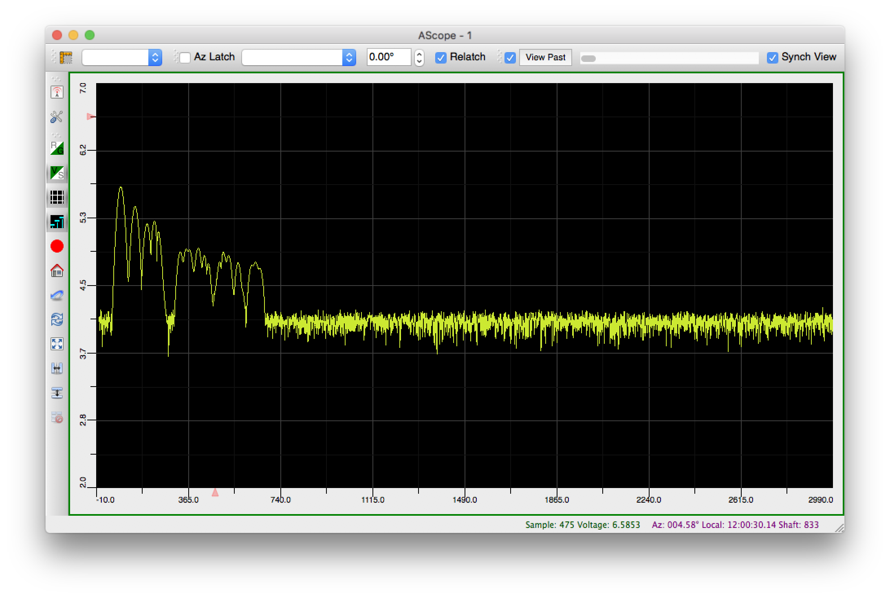
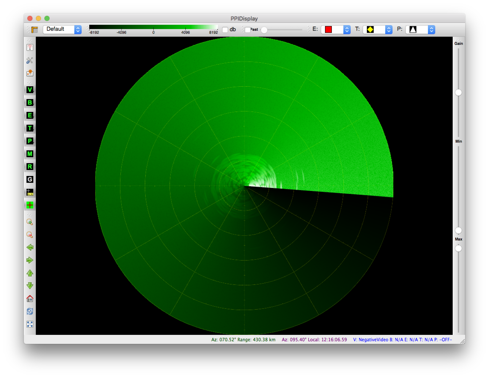

# Introduction

The main goal of the Radar SideCar software project is to create a highly adaptable environment for running
signal processing algorithms. Users configure signal processing streams using XML configuration files that
define how information flows from algorithm to algorithm and how data flows from machine to machine in the
SideCar LAN.

There are several applications available which provide a graphical interface to the user:

* AScope - a software oscilloscope for viewing data samples ([additional info](http://keystrokecountdown.com/articles/ascope/index.html))
* BScope - a rectangular representation of radar returns - contrast with PPIDisplay's polar display ([additional info](http://keystrokecountdown.com/articles/bscope/index.html))
* Master - a process manager application that shows the active processing streams running in the SideCar LAN
* Playback - an application that can playback recorded data files. Supports playback rate changing and looping when it reaches the end of a data file
* PPIDisplay - a simulation of a phosphor plot position indicator (PPI) display. Even has a crude simulated decay effect for those that can't live without phosphor decay ([additional info](http://keystrokecountdown.com/articles/radardisplay/index.html))

Various signal processing algorithms can be found in the Algorithms directory.

# Documentation

Many but not all of the source headers have JavaDoc-style comments. Using `doxygen`, one can convert them into
a static web site:

```
% cd ~/src/sidecar
% doxygen doc/Doxyfile
```

The HTML output will reside under the `docs/`. It is available online at
https://bradhowes.github.io/sidecar/index.html

# Building

Building has worked on various Linux and MacOS X systems. Nearly all of the code is C++ with some bits in C. The
code relies on the following external libraries:

* [ACE](http://www.cs.wustl.edu/~schmidt/ACE.html) - should work with at least version 5.5
* [Boost C++ Framework](http://boost.org) - built and tested using v1.60.0
* [Qt](http://qt.io) - built and tested using v4.8.7. **Will not compile under v5**
* [Zeroconf](http://www.zeroconf.org) - on Linux, requires Avahi's mDNS API emulation support (legacy)
* [OpenVSIP](https://github.com/openvsip/openvsip) - vector signal and image processing library

[CMake](https://cmake.org) scripts control the building process, and require at least v3.6. The usual way to
build is to create a build directory, move into it and then execute `cmake ..` to generate Makefiles, like so:

```
% cd ~/src/sidecar
% mkdir build
% cd build
% cmake ..
```

If successful, one should then just type `make` to build the executables.

## MacOS Installation Notes

Here are some brief notes on getting everything to run on macOS. This works on my MacBook Pro 2017 running High
Sierra (10.13.3). Install the [Brew](https://brew.sh) package manager if you don't already have it. Next,
install the following packages (I've noted the versions that I currently have)

```
% brew install cmake # 3.10.3
% brew install ace # 6.4.7
% brew install boost # 1.66.0
% brew install fftw # 3.3.7
% brew install open-mpi # 3.0.0
```

Unfortunately, SideCar also needs a legacy (v4) version of [Qt](https://qt.io). There is a Brew formula
available for this at https://github.com/cartr/homebrew-qt4 -- see the instructions there for installing.

The software also needs an implementation of the
[Vector Signal and Image Processing Library](http://openvsip.org) spec. I have a slightly modified fork of
[OpenVSIP](https://github.com/openvsip/openvsip) that compiles on macOS. To install:

```
% git clone https://github.com/bradhowes/openvsip.git
% cd openvsip
% ./autogen.sh
% mkdir objdir
% cd objdir
% ../configure --with-lapack=apple # only if on macOS
```

If all goes well with `configure`, you should be able to build:

```
% make
% make install
```

If `configure` has issues, you will have to explore its options to see if you can get it to do what you want.

Now to build SideCar:

```
% git clone https://github.com/bradhowes/sidecar.git
% cd sidecar
% mkdir build
% cd build
% cmake ..
```

Hopefully `CMake` will find everything and run without errors. Next:

```
% make
```

This will take some time -- you can try adding `-j N` where N is something like the number of CPUs on your
machine.

Note that in the instructions below `<SIDECAR>` will refer to the source directory of the Git clone.

## Post Install

The SideCar applications rely on IPv4 multicast for transmitting data between them (using Zeroconf/Bonjour to
determine who is around to listen to). For best results, you should probably route multicast traffic over your
loopback interface. The apps are hardcoded (I think) to use the address `237.1.2.100` for multicast traffic.

```
% sudo route add -net 237.1.2.100/32 -interface lo0
```

There are some binary files in the `data/pri` directory that need to be joined before they can be used:

```
% cd <SIDECAR>/data/pri
% bash prijoin.sh
```

# Demonstration

If all of the above went well, we can test out the apps in the `build/bin` directory. First, let's try and emit
some data:

```
% cd <SIDECAR>/build/bin
% open priemitter.app
```

You should see something like


Now, try loading the data file `<SIDECAR>/data/pri/20t10scans.pri` Make sure that the `Connection Type` is set
to `Multicast`


The window shows `Connections: 0` because no one is listening for data on the `NegativeVideo` channel. Let's see
if we can get an app to do so:

```
% open ascope.app
```

The AScope app will show something like an osciliscope display that plots data samples from a data source.


When it starts up, it won't be connected to anything. Bring up the `Channels Window` (**⌘ 1**) and you should
see one channel available:


Click on the `+` button at the bottom to subscribe to the channel and close the window. Back in the `priemitter`
app, click the `Start` button. With a good amount of luck, you should see something like this:



Now, let's try for the big fish: `ppidisplay`. This application attempts to display incoming data in a format
similar to a radar display. However, unlike its cousin `ascope`, this application needs to know a bit about the
incoming data in order to properly display it. We will point it to an XML configuration file that properly
describes the format of the `20t10scans` data we are emitting:

```
% cd <SIDECAR>/data/pri
% export SIDECAR_CONFIG="$PWD/20t10scans.xml"
% cd ../../build/bin
% open ppidisplay.app
```

Bring up the `Channel Selector` window with **⌘ 1** and select `NegativeVideo` for the `Video` source. You
should start to see data flow to the display.


